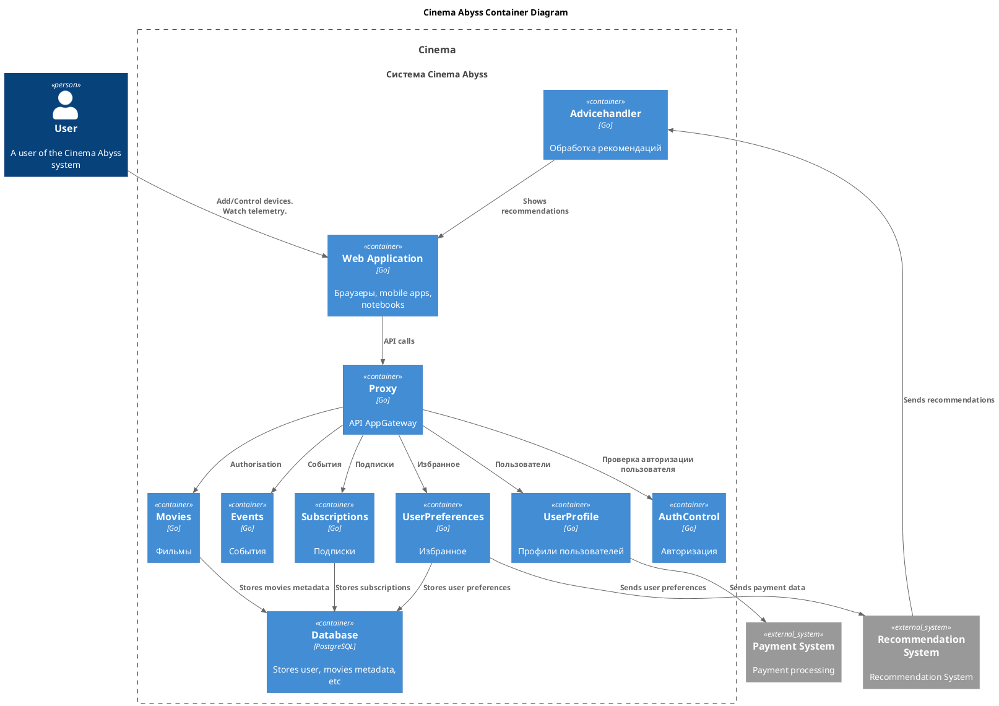
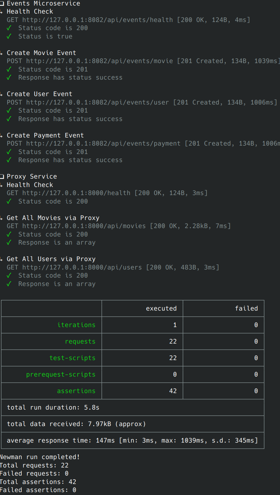
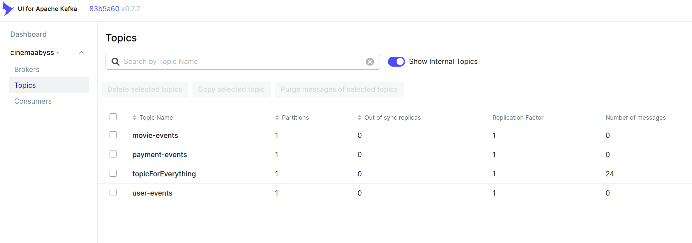
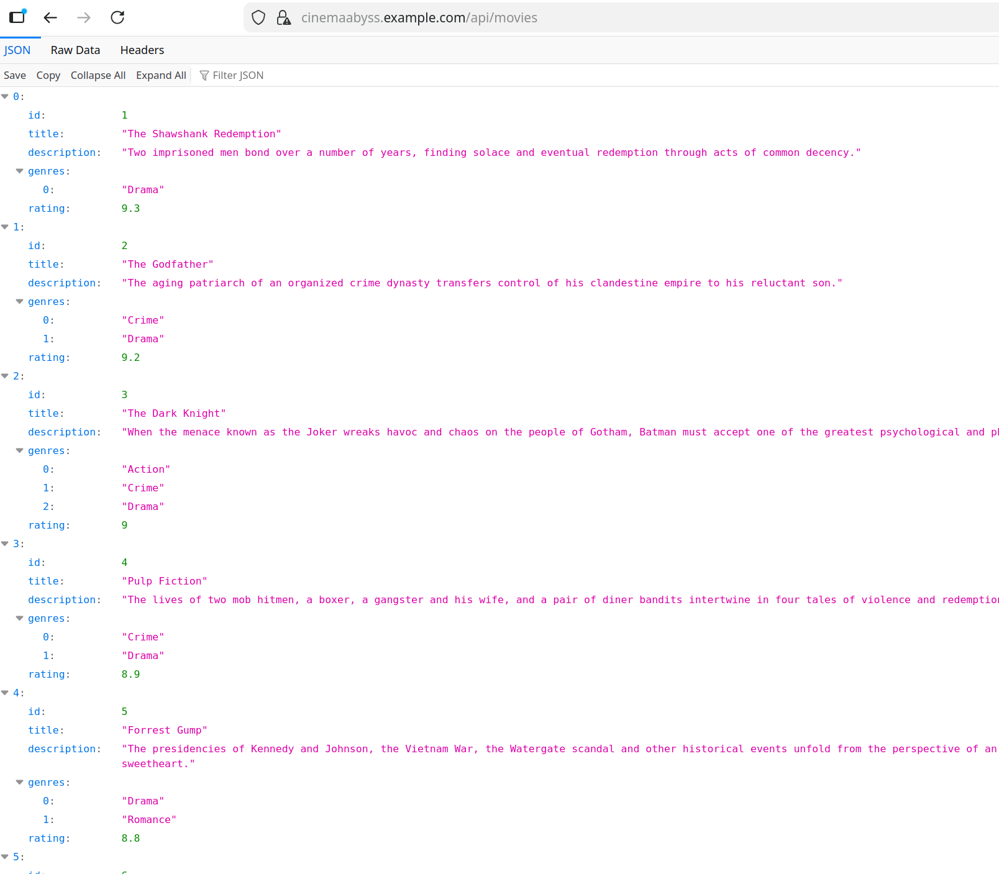
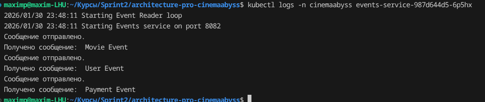
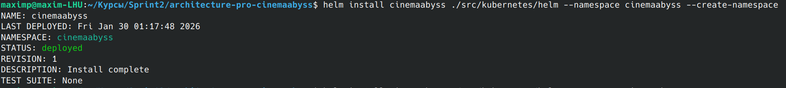
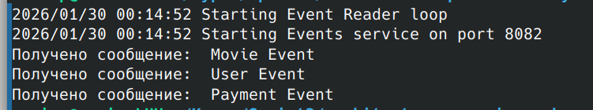

## Изучите [README.md](README.md) файл и структуру проекта.

## Задание 1

1. Спроектируйте to be архитектуру КиноБездны, разделив всю систему на отдельные домены и организовав интеграционное взаимодействие и единую точку вызова сервисов.
Результат представьте в виде контейнерной диаграммы в нотации С4.
Добавьте ссылку на файл в этот шаблон





## Задание 2

### 1. Proxy
Команда КиноБездны уже выделила сервис метаданных о фильмах movies и вам необходимо реализовать бесшовный переход с применением паттерна Strangler Fig в части реализации прокси-сервиса (API Gateway), с помощью которого можно будет постепенно переключать траффик, используя фиче-флаг.


Реализуйте сервис на любом языке программирования в ./src/microservices/proxy.

**DONE**

- После реализации запустите postman тесты - они все должны быть зеленые.
- Отправьте запросы к API Gateway:
   ```bash
   curl http://localhost:8000/api/movies
   ```
- Протестируйте постепенный переход, изменив переменную окружения MOVIES_MIGRATION_PERCENT в файле docker-compose.yml.

**DONE**


### 2. Kafka
 Вам как архитектуру нужно также проверить гипотезу насколько просто реализовать применение Kafka в данной архитектуре.

Для этого нужно сделать MVP сервис events, который будет при вызове API создавать и сам же читать сообщения в топике Kafka.

    - Разработайте сервис на любом языке программирования с consumer'ами и producer'ами.
    - Реализуйте простой API, при вызове которого будут создаваться события User/Payment/Movie и обрабатываться внутри сервиса с записью в лог
    - Добавьте в docker-compose новый сервис, kafka там уже есть

Необходимые тесты для проверки этого API вызываются при запуске npm run test:local из папки tests/postman 
Приложите скриншот тестов и скриншот состояния топиков Kafka http://localhost:8090 

**DONE**






## Задание 3

Команда начала переезд в Kubernetes для лучшего масштабирования и повышения надежности. 
Вам, как архитектору осталось самое сложное:
 - реализовать CI/CD для сборки прокси сервиса
 - реализовать необходимые конфигурационные файлы для переключения трафика.


### CI/CD

 В папке .github/worflows доработайте деплой новых сервисов proxy и events в docker-build-push.yml , чтобы api-tests при сборке отрабатывали корректно при отправке коммита в вашу новую ветку.


Как только сборка отработает и в github registry появятся ваши образы, можно переходить к блоку настройки Kubernetes
Успешным результатом данного шага является "зеленая" сборка и "зеленые" тесты


**docker-build-push.yml изменен**


### Proxy в Kubernetes

#### Шаг 1
Для деплоя в kubernetes необходимо залогиниться в docker registry Github'а.
1. Создал Personal Access Token (PAT) https://github.com/settings/tokens с правом read:packages
2. В src/kubernetes/*.yaml (event-service, monolith, movies-service и proxy-service)  отредактировал путь до images в моем github repo (ghrc.io/логин/репо/image) 

3. Добавил в секрет src/kubernetes/dockerconfigsecret.yaml

 - Залогинился докером в github при помощи docker login, пользователя и токена (github не поддерживает docker login по паролю).
 - Получил  ~/.docker/config.json c токеном
{
        "auths": {
                "ghcr.io": {
                       токен
                }
        }
}

- Выполнил:
```bash
cat .docker/config.json | base64
```
- Полученное значение добавил в секрет *src/kubernetes/dockerconfigsecret.yaml* в строке:
```bash
 .dockerconfigjson: значение в base64 файла ~/.docker/config.json
```

#### Шаг 2

- Доработал src/kubernetes/event-service.yaml и src/kubernetes/proxy-service.yaml:

  - Cоздал в каждом файле
  kind: Deployment и kind:Service 
  - Доработал ingress.yaml, чтобы можно было с помощью тестов проверить создание событий - маршруты.

- Cтартовал minikube и сразу добавил addons  ingress-dns и ingress
```bash
minikube start
minikube addons enable ingress-dns
minikube addons enable ingress
```

- Выполнил как указано дальнейшие шаги для поднятия кластера:

  1. Создать namespace (замечание: helm uninstall его не удаляет):
  ```bash
  kubectl apply -f src/kubernetes/namespace.yaml
  ```
  2. Создать секреты и переменные
  ```bash
  kubectl apply -f src/kubernetes/configmap.yaml
  kubectl apply -f src/kubernetes/secret.yaml
  kubectl apply -f src/kubernetes/dockerconfigsecret.yaml
  kubectl apply -f src/kubernetes/postgres-init-configmap.yaml
  ```

  3. Развернуть базу данных:
  ```bash
  kubectl apply -f src/kubernetes/postgres.yaml
  ```

  На этом этапе если вызвать команду
  ```bash
  kubectl -n cinemaabyss get pod
  ```
  видим

  NAME         READY   STATUS    
  postgres-0   1/1     Running   

  4. Развернуть Kafka:
  ```bash
  kubectl apply -f src/kubernetes/kafka/kafka.yaml
  ```

  Проверить, что запущено 3 пода, если что-то не так, то посмотреть логи пода kafka (например - kafka-0)
  ```bash
  kubectl -n cinemaabyss logs имя_пода 
  ```

  5. Развернуть монолит:
  ```bash
  kubectl apply -f src/kubernetes/monolith.yaml
  ```
  6. Развернуть микросервисы:
  ```bash
  kubectl apply -f src/kubernetes/movies-service.yaml
  kubectl apply -f src/kubernetes/events-service.yaml
  ```
  7. Развернуть прокси-сервис:
  ```bash
  kubectl apply -f src/kubernetes/proxy-service.yaml
  ```

  После запуска и поднятия подов вывод команды 
  ```bash
  kubectl -n cinemaabyss get pod
  ```

  Будет наподобие такого

  NAME                              READY   STATUS    

  events-service-7587c6dfd5-6whzx   1/1     Running  

  kafka-0                           1/1     Running   

  monolith-8476598495-wmtmw         1/1     Running  

  movies-service-6d5697c584-4qfqs   1/1     Running  

  postgres-0                        1/1     Running  

  proxy-service-577d6c549b-6qfcv    1/1     Running  

  zookeeper-0                       1/1     Running 

  8. Развернуть ingress

- ingress addons уже были активированы в minikube - см. выше.
- настраиваем ingress в самом kubernetes:
  ```bash
  kubectl apply -f src/kubernetes/ingress.yaml
  ```
  9. Вызвать (до редактирования /etc/hosts)
  ```bash
  minikube tunnel
  ```
  и получил внешний IP

  10. Добавил в /etc/hosts cinemaabyss.example.com, но не на 127.0.0.1, а взял из minikube tunnel

  192... cinemaabyss.example.com

  
  11. Вызовите https://cinemaabyss.example.com/api/movies
  Вы должны увидеть вывод списка фильмов
  Можно поэкспериментировать со значением   MOVIES_MIGRATION_PERCENT в src/kubernetes/configmap.yaml и убедится, что вызовы movies уходят полностью в новый сервис

  12. Запустите тесты из папки tests/postman
  ```bash
   npm run test:kubernetes
  ```
  Часть тестов с health-чек упадет, но создание событий отработает.
  Откройте логи event-service и сделайте скриншот обработки событий

  
#### Шаг 3
Добавьте сюда скриншоты вывода при вызове https://cinemaabyss.example.com/api/movies и  скриншот вывода event-service после вызова тестов.

****

****


## Задание 4
Для простоты дальнейшего обновления и развертывания вам как архитектуру необходимо так же реализовать helm-чарты для прокси-сервиса и проверить работу 

Для этого:
1. Перейдите в директорию helm и отредактируйте файл values.yaml

  - Вместо ghcr.io/db-exp/cinemaabysstest/proxy-service написал свой путь к images.
  - для imagePullSecret проставил свое значение (скопировал из конфигурации kubernetes)
  ```yaml
  imagePullSecrets:
      dockerconfigjson: base64-value
  ```

2. В папке ./templates/services заполнил шаблоны для proxy-service.yaml и events-service.yaml (опирайтесь на свою kubernetes конфигурацию - смысл helm'а сделать шаблоны для быстрого обновления и установки).

Пришлось поправить movies-service.yml тоже: movies-service вместо movies в http-пути.


3. Проверка установки
  - Сначала удалил установку руками

```bash
kubectl delete all --all -n cinemaabyss
kubectl delete  namespace cinemaabyss
```

  - Запустил
```bash
helm install cinemaabyss ./src/kubernetes/helm --namespace cinemaabyss --create-namespace
```

  - Проверил развертывание:
```bash
kubectl get pods -n cinemaabyss
```

  - Вызвал 
https://cinemaabyss.example.com/api/movies
и приложите скриншот развертывания helm и вывода https://cinemaabyss.example.com/api/movies

****

****

# Задание 5
Компания планирует активно развиваться и для повышения надежности, безопасности, реализации сетевых паттернов типа Circuit Breaker и канареечного деплоя вам как архитектору необходимо развернуть istio и настроить circuit breaker для monolith и movies сервисов.

```bash

helm repo add istio https://istio-release.storage.googleapis.com/charts
helm repo update

helm install istio-base istio/base -n istio-system --set defaultRevision=default --create-namespace
helm install istio-ingressgateway istio/gateway -n istio-system
helm install istiod istio/istiod -n istio-system --wait

helm install cinemaabyss .\src\kubernetes\helm --namespace cinemaabyss --create-namespace

kubectl label namespace cinemaabyss istio-injection=enabled --overwrite

kubectl get namespace -L istio-injection

kubectl apply -f .\src\kubernetes\circuit-breaker-config.yaml -n cinemaabyss

```

Тестирование

# fortio
```bash
kubectl apply -f https://raw.githubusercontent.com/istio/istio/release-1.25/samples/httpbin/sample-client/fortio-deploy.yaml -n cinemaabyss
```

# Get the fortio pod name
```bash
FORTIO_POD=$(kubectl get pod -n cinemaabyss | grep fortio | awk '{print $1}')

kubectl exec -n cinemaabyss $FORTIO_POD -c fortio -- fortio load -c 50 -qps 0 -n 500 -loglevel Warning http://movies-service:8081/api/movies
```
Например,

```bash
kubectl exec -n cinemaabyss fortio-deploy-b6757cbbb-7c9qg  -c fortio -- fortio load -c 50 -qps 0 -n 500 -loglevel Warning http://movies-service:8081/api/movies
```

Вывод будет типа такого

```bash
IP addresses distribution:
10.106.113.46:8081: 421
Code 200 : 79 (15.8 %)
Code 500 : 22 (4.4 %)
Code 503 : 399 (79.8 %)
```
Можно еще проверить статистику

```bash
kubectl exec -n cinemaabyss fortio-deploy-b6757cbbb-7c9qg -c istio-proxy -- pilot-agent request GET stats | grep movies-service | grep pending
```

И там смотрим 

```bash
cluster.outbound|8081||movies-service.cinemaabyss.svc.cluster.local;.upstream_rq_pending_total: 311 - столько раз срабатывал circuit breaker
You can see 21 for the upstream_rq_pending_overflow value which means 21 calls so far have been flagged for circuit breaking.
```

Приложите скриншот работы circuit breaker'а

Удаляем все
```bash
istioctl uninstall --purge
kubectl delete namespace istio-system
kubectl delete all --all -n cinemaabyss
kubectl delete namespace cinemaabyss
```
